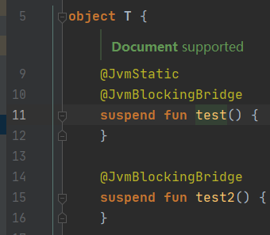
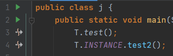
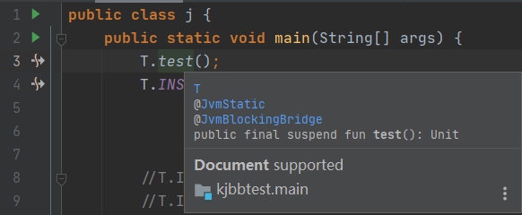

# kotlin-jvm-blocking-bridge

**[ENGLISH 英文](./README.md)**

为 Kotlin `suspend` 函数快速生成阻塞式方法桥的 Kotlin 编译器插件.

## 截图
<details>

<summary>点击左侧箭头查看</summary>

Kotlin 挂起函数:  


阻塞式方法桥调用:  


文档和跳转支持:  


</details>

### 动机
Kotlin 会将 `suspend` 函数编译后加上一个额外参数 `$completion: Continuation`. 在 Java 调用这样的方法很困难, 我们经常会做一些兼容.

例如, 对于
```kotlin
suspend fun downloadImage(): Image
```
我们可能会为 Java 使用者额外添加
```kotlin
@JvmName("downloadImage") // 避免引用歧义
fun downloadImageBlocking(): Image = runBlocking { downloadImage() }
```

然而, 这也带来了一些问题:
- KDoc 需要从原函数复制到额外添加的函数, 并且修改时要同时修改两者.
- 修改函数签名(参数, 修饰符, 返回值, 注解)变得十分不便.
- 我们不希望将 `downloadImageBlocking` 暴露给 Kotlin 调用方, 但我们没有方法隐藏他们.  
  解决方法是添加 `RequiresOptIn`:
  ```kotlin
  @RequiresOptIn(level = ERROR)
  annotation class JavaFriendlyApi
  
  @JavaFriendlyApi // 于是当 Kotlin 调用者调用这个函数时, IDE 会报告 ERROR 级别的错误 'Experimental API usage'
  @JvmName("downloadImage") // 避免引用歧义
  fun downloadImageBlocking(): Image = runBlocking { downloadImage() }
  ```
  但这似乎并不是最好的解决方式----我们要重复 `JavaFriendlyApi` 这样的注解很多次. 还需要到处使用它.
- 我们也不希望将 `suspend` 函数暴露给 Java 调用方----因为大多数 Java 调用者不会愿意自己实现协程 `Continuation`  
  因此我们又添加 `@JvmSynthetic`. 最终的代码为:
  ```kotlin
  @JvmSynthetic
  suspend fun downloadImage(): Image

  @RequiresOptIn(level = ERROR)
  annotation class JavaFriendlyApi
  
  @JavaFriendlyApi // so IDE reports 'Experimental API usage' error for calling from Kotlin.
  @JvmName("downloadImage") // avoid resolution ambiguity
  fun downloadImageBlocking(): Image = runBlocking { downloadImage() }
  ```
  这仅仅是为了一个函数做的兼容. 这些样板代码不仅无法完美解决问题, 又需要不断重复, 降低开发效率.

本编译器插件设计为最小化兼容 Java 时所作的额外工作----仅需添加一个注解:
```kotlin
@JvmBlockingBridge
suspend fun downloadImage(): Image
```
编译器会帮助生成 `fun downloadImage()`, 使用相同的方法签名 (编译级的生成不会引起 resolution ambiguity).  
IDE (IntelliJ) 插件会帮助为 Java 调用方隐藏 `suspend fun downloadImage`, 并让他们能引用到生成的阻塞式方法桥 (在编译之前).

## 模块
- **运行时库**  *provides @JvmBlockingBridge annotation*
- **编译器插件**  *provides bridge generators, supporting current JVM backend and experimental IR backend*
- **ide-plugin**  *for IntelliJ platform IDEs only*

**在 [BridgeFeatures.md](BridgeFeatures.md) 阅读规范**

### 运行时库

- 提供 `public annotation class net.mamoe.kjbb.JvmBlockingBridge`
- 提供 `internal annotation class net.mamoe.kjbb.GeneratedBlockingBridge`, 由编译器插件自动添加到生成的方法桥上.

### 编译器插件

Given Kotlin `suspend` function:
```kotlin
@JvmBlockingBridge
suspend fun test(a1: Int, a2: Any): String
```

This plugin generates the non-suspend bridge function with the same signature (visible only from Java)
```kotlin
@GeneratedBlockingBridge
fun test(a1: Int, a2: Any): String = runBlocking { test(a1, a2) }
```

### IDE (IntelliJ) 插件

- 在发现 `@JvmBlockingBridge` 引用时诊断编译器插件依赖的存在性
- 为 Java 用户隐藏标记了 `@JvmBlockingBridge` 的 `suspend` 函数
- 让 Java 用户能引用阻塞式方法桥 (即使它们还没有生成)
- 为 Kotlin 用户隐藏生成的阻塞式方法桥 (即使它们已经生成)

## 使用要求
- Gradle (仅在 6.0+ 环境通过测试)
- **Kotlin 1.4.0-rc, 1.4.0 或更高**
- IntelliJ IDEA 或 Android Studio (推荐保持新版本)

## 现在体验

编译器插件已经完成, 可添加 Gradle 插件依赖:

1. **安装 IntelliJ IDEA (或 Android Studio) 插件**
   本插件支持 IntelliJ IDEA 2019.\* 到 2020.\*
   It's strongly recommended using the latest IntelliJ or AS, you may update using [JetBrains ToolBox](https://www.jetbrains.com/toolbox-app/)  
   Please note that Eclipse and Visual Studio aren't supported.

   1. Open `File->Settings->Plugins->Marketplace` in your IDE
   2. Search `Kotlin Jvm Blocking Bridge`, download and install
   3. Restart your IDE


2. **安装 Gradle 插件.**

`build.gradle` 或 `build.gradle.kts`
```kotlin
plugins {
  id("net.mamoe.kotlin-jvm-blocking-bridge") version "0.5.0"
}
```

如果 Gradle 无法下载这个插件, 请在 `settings.gradle` 或 `settings.gradle.kts` 中添加 `gradlePluginPortal()`:
```kotlin
pluginManagement {
    repositories {
        gradlePluginPortal()
    }
}
```

本插件会自动添加如下的运行时依赖:
```kotlin
implementation("net.mamoe:kotlin-jvm-blocking-bridge:0.5.0")
```
因此只需要安装插件, 而不需要添加依赖即可使用

## 支持的编译器后端

Kotlin 拥有两个编译器后端, 旧 `JVM` 和新 `IR`(Intermediate Representation).  
Kotlin 默认使用目前较稳定的 `JVM` 后端, 但将在未来启用 `IR` 后端.

本插件同时支持这两个后端. 若在使用时遇到编译错误 (堆栈中能找到 `net.mamoe.kjbb`), 请切换到 `IR` 后端.
但注意: 由于 `IR` 目前还不稳定, 请仅在遇到错误时切换.

要启用 IR 后端, 添加下面内容到 `build.gradle` 或 `build.gradle.kts`
```kotlin=
tasks.withType<KotlinCompile> {
    kotlinOptions.useIR = true
}
```
